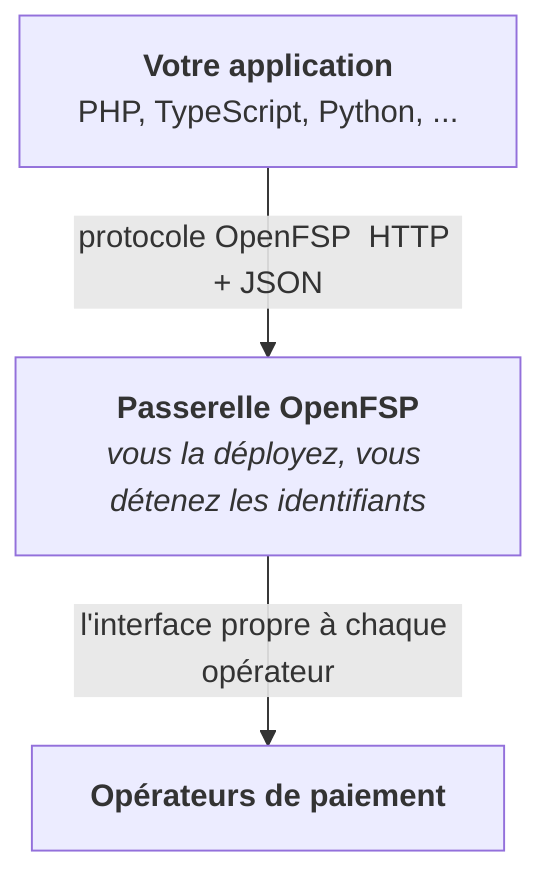

# OpenFSP

## Une norme ouverte d'interopérabilité des paiements en Haïti

[Read in English](README.md)

Haïti a des services de paiement numérique qui fonctionnent et aucune interopérabilité
entre eux. Chaque intégration marchande est écrite de zéro, par opérateur, dans chaque
langage. Les bacs à sable des opérateurs exercent le chemin heureux, et les chemins de
défaillance, ceux qui coûtent de l'argent, ne se déclenchent pas sur commande. Ajouter un
second opérateur revient à écrire une seconde intégration.

OpenFSP remplace cela par un protocole ouvert unique, accompagné d'une passerelle
auto-hébergée qui l'implémente et de bibliothèques clientes légères.

L'intégration d'un opérateur est écrite **une seule fois**, dans la passerelle, et chaque
langage en bénéficie.

## Ce que nous construisons

| | |
|---|---|
| 📚 **La spécification** | Le protocole : modèle de données, cycle de vie du paiement, capacités, erreurs, idempotence, notifications. Arrêté au grand jour par un processus RFC. |
| ⚙️ **La passerelle** | Un serveur auto-hébergé en Kotlin et Spring Boot : le protocole OpenFSP en entrée, les interfaces des opérateurs en sortie. Un adaptateur par opérateur. |
| 🧪 **Le simulateur** | Imite les opérateurs réels, modes de défaillance compris, pour développer et tester sans compte marchand. |
| 📦 **Les bibliothèques clientes** | Des clients minces du protocole, idiomatiques pour chaque écosystème. Le HTTP nu fonctionne toujours aussi. |
| ✅ **La suite de conformité** | Exécutable par machine. Une conformité qu'on ne peut pas exécuter n'est pas une conformité. |

## Ce qu'OpenFSP n'est pas

Des limites permanentes, non la description d'un début :

- Le projet **ne détient ni ne déplace de fonds**.
- Il **n'exploite aucun service hébergé**. C'est vous qui déployez la passerelle.
- Il **n'est pas un établissement de paiement agréé**, et ne remplace ni agrément ni
  convention.
- Il **n'est ni un commutateur ni un système de règlement**.

## Principes

- **Rien n'est jamais feint.** Une opération qu'un opérateur ne peut pas effectuer est
  absente et découvrable comme absente, jamais émulée.
- **Jamais de dégradation silencieuse.** Pas de bascule automatique, pas de succès partiel
  rapporté comme un succès.
- **Sûr à rejouer.** Toute opération qui modifie un état est idempotente, parce que les
  réseaux tombent entre l'arrivée de la requête et le retour de la réponse.
- **Ennuyeux à dessein.** HTTP, JSON, des normes existantes. Implémentable avec une
  bibliothèque standard.
- **Ouvert, et impossible à refermer.** Apache-2.0 partout, aucun accord de cession de
  droits.

## État

**Spécification à l'état de brouillon.** Seize RFC sont écrites, en anglais et en
français. Rien n'est encore implémenté, et rien ne devrait être utilisé en production. Le
travail en cours consiste à arrêter le protocole au grand jour avant d'écrire du code
qu'il serait coûteux de défaire.

C'est le meilleur moment pour l'influencer.

## Par où commencer

| | |
|---|---|
| [**Les RFC**](https://rfc.openfsp.org) | La spécification, lisible en ligne dans les deux langues. |
| [**openfsp**](https://github.com/openfspht/openfsp) | Le dépôt de la spécification : sources des RFC, gouvernance, registre des opérateurs. |

## Contribuer

Développeurs, opérateurs de paiement, institutions financières, chercheurs et autorités
publiques sont tous bienvenus, par le même processus RFC public, sans voie privée.

La gouvernance, les intérêts déclarés du porteur du projet, et les conditions dans
lesquelles la gouvernance s'ouvre à un comité de pilotage sont écrits plutôt
que sous-entendus.

## Licence

**Apache-2.0** : la spécification, la passerelle, le simulateur, les bibliothèques
clientes et la suite de conformité, sans exception. Les contributions relèvent du
Developer Certificate of Origin : vous gardez votre droit d'auteur, rien n'est cédé, et le
projet ne peut pas être refermé plus tard.

---

Projet porté par <a href="https://karakosystems.com">Karako Systems</a> · Construit en Haïti, pour Haïti.
