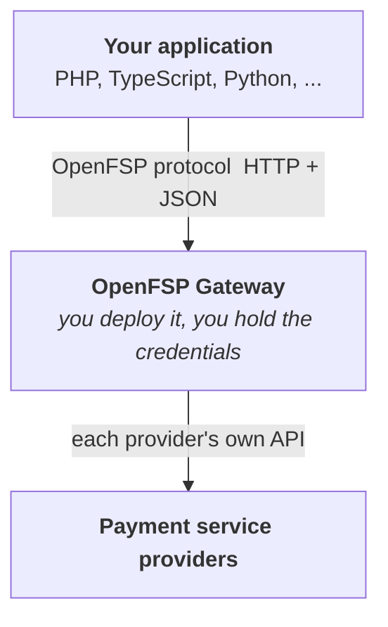

# OpenFSP

## An open standard for payment interoperability in Haiti

[Lire en français](README.fr.md)

Haiti has working digital payment services and no interoperability between them. Every
merchant integration is written from scratch, per provider, in every language. Testing
means using production with real money. Adding a second provider means writing a second
integration.

OpenFSP replaces that with a single open protocol, plus a self-hosted gateway that
implements it, and thin client SDKs.

Provider integration is written **once**, in the gateway, and every language gets it.

## What we build

| | |
|---|---|
| 📚 **The specification** | The protocol: data model, payment lifecycle, capabilities, errors, idempotency, webhooks. Settled in the open through an RFC process. |
| ⚙️ **The gateway** | A self-hosted Kotlin and Spring Boot server: OpenFSP protocol in, provider APIs out. One adapter per provider. |
| 🧪 **The mock server** | Imitates real providers, failure modes included, so you can build and test without a merchant account. |
| 📦 **The SDKs** | Thin protocol clients, idiomatic per ecosystem. Plain HTTP always works too. |
| ✅ **The conformance suite** | Machine-executable. A conformance claim you cannot run is not a claim. |

## What OpenFSP is not

Permanent boundaries, not a description of an early stage:

- It **does not hold or move funds**.
- It **operates no hosted service**. You deploy the gateway.
- It is **not a licensed payment institution**, and replaces no licence or agreement.
- It is **not a switch or settlement system**.

## Principles

- **Nothing is ever faked.** An operation a provider cannot perform is absent and
  discoverable as absent, never emulated.
- **Never silently degraded.** No automatic failover, no partial success reported as
  success.
- **Safe to retry.** Every mutating operation is idempotent, because networks fail
  between the request arriving and the response returning.
- **Boring on purpose.** HTTP, JSON, existing standards. Implementable with a standard
  library.
- **Open, and unable to close.** Apache-2.0 throughout, no contributor licence agreement.

## Status

**Specification draft.** Sixteen RFCs are written, in English and French. Nothing is
implemented yet, and nothing should be used in production. The current work is settling
the protocol in the open before writing code that would be expensive to unwrite.

This is the best moment to influence it.

## Where to start

| | |
|---|---|
| [**The RFCs**](https://rfc.openfsp.org) | The specification, readable online in both languages. |
| [**openfsp**](https://github.com/openfspht/openfsp) | The specification repository: RFC sources, governance, the provider registry. |

## Contributing

Developers, payment service providers, financial institutions, researchers and public
authorities are all welcome, through the same public RFC process, with no private track.

Governance, the declared interests of the project's steward, and the conditions under
which governance opens to a steering committee are all written down rather than implied.

## Licence

**Apache-2.0**: the specification, the gateway, the mock server, the SDKs, and the
conformance suite alike. Contributions under the Developer Certificate of Origin: you
keep your copyright, nothing is assigned, and the project cannot be re-closed later.

---

Stewarded by <a href="https://karakosystems.com">Karako Systems</a> · Built in Haiti, for Haiti.
